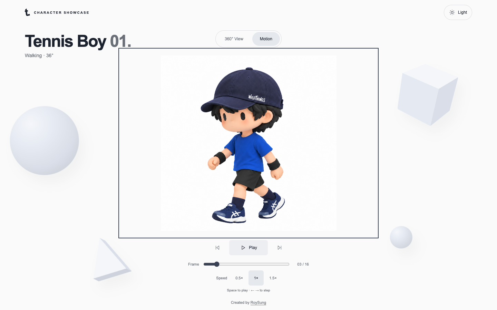

# Tennis Boy — Character Showcase

An interactive, frame-based 2.5D character showcase built with React, TypeScript, and Vite. Explore two standing character turntables or play Tennis Boy 01's sixteen-frame walking cycle inside a layered Japanese tennis-center scene.

[View the live showcase](https://roysung.github.io/tennis-boy-showcases-website/)



## Highlights

- Drag, swipe, use the angle slider, or press the arrow keys to rotate through the standing views.
- Switch between Tennis Boy 01 and the racket-carrying Tennis Boy 02.
- Play, pause, step, scrub, and change the speed of the sixteen-frame walking cycle.
- Watch a layered environment with drifting clouds, scrolling scenery, props, and varied tennis-ball paths.
- Use the complete interface with a keyboard and visible focus states.
- Respect the system's reduced-motion preference throughout the character and environment animation.

The showcase uses transparent PNG artwork rather than a 3D model or skeletal animation. Adjacent standing views are blended to suggest depth while preserving the supplied character assets.

## Controls

### 360° View

- Drag or swipe horizontally to rotate.
- Use the arrow keys or angle slider for precise control.
- Choose Front, Left, Back, or Right for orientation shortcuts.
- Toggle automatic rotation or use Reset to return to the front.

### Motion

- Press Space to play or pause.
- Use Left/Right to step through frames and Home/End to jump to the first/last frame.
- Scrub the frame slider or choose 0.5×, 1×, or 1.5× playback.

## Local development

Requirements: Node.js 22.13 or newer and npm.

```sh
npm ci
npm run dev -- --port 5188 --strictPort
```

Open <http://localhost:5188>. Vite also prints a network URL that can be used to test on a phone connected to the same network.

### Validation

```sh
npm test
npm run build
```

Additional image checks require Python 3 and Pillow:

```sh
python3 -m pip install Pillow
npm run verify:assets
npm run verify:gait
```

`verify:assets` validates the walking PNG set. `verify:gait` checks fixed image proxies for support-foot jumps and paired body/swing heights; it supplements visual review rather than performing anatomical tracking.

## Project structure

```text
src/
  App.tsx                    Character and exhibit selection
  StandingViewer.tsx         Turntable loading, input, and rotation
  MotionViewer.tsx           Walking-frame loading and playback
  CourtBackdrop.tsx          Panorama, clouds, and atmosphere
  StageForeground.tsx        Floodlights, planters, and tennis ball
  character.ts               Tennis Boy 01 standing-view configuration
  racket.ts                  Tennis Boy 02 standing-view configuration
  walking.ts                 Walking frames and playback timing
  environment.ts             Scene timing and ball-path helpers
  style.css                  Responsive layout and compositing
public/
  character/                 Turntable, racket, and walking PNG assets
  environment/               Layered tennis-center artwork
docs/
  prompts/                   Reusable generation prompts and provenance
  qa/                        Visual checks and validation records
  *-assets.json              Asset metadata and checksums
tests/motion.test.tsx        Interaction and playback regression tests
PRODUCT.md                   Product scope and principles
DESIGN.md                    Detailed visual and interaction direction
```

## Asset notes

The standing views are visual angle estimates, not measured camera yaw. Keep new or replacement artwork aligned to the existing body axis, character scale, and shoe baseline, and update its configuration and metadata together.

- Tennis Boy 01: eleven views at 0°, 36°, 60°, 90°, 108°, 144°, 180°, 216°, 252°, 288°, and 324°.
- Tennis Boy 02: twelve views at 30° intervals.
- Motion: sixteen transparent frames at 16 fps for a one-second, two-step cycle.

See [the prompt guide](docs/prompts/README.md), [turntable metadata](docs/turntable-assets.json), [racket metadata](docs/racket-assets.json), and [walking metadata](docs/walking-assets.json) for the source mappings and maintenance details.

## Deployment

Pushes to `main` run the test suite and production build in GitHub Actions. A successful build uploads `dist/` and deploys it to GitHub Pages. The workflow can also be started manually from the Actions tab.

The deployment workflow sets `VITE_BASE_URL=/tennis-boy-showcases-website/`. Vite uses that value for bundled files and runtime public assets, matching the GitHub Pages project URL without hard-coding a production path in application code.

## Credits

Created by RoySung.
